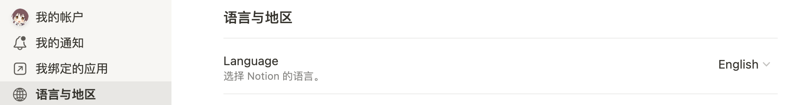
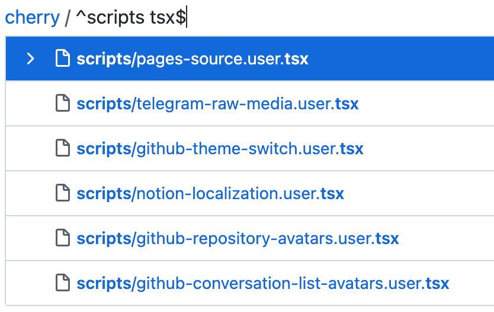
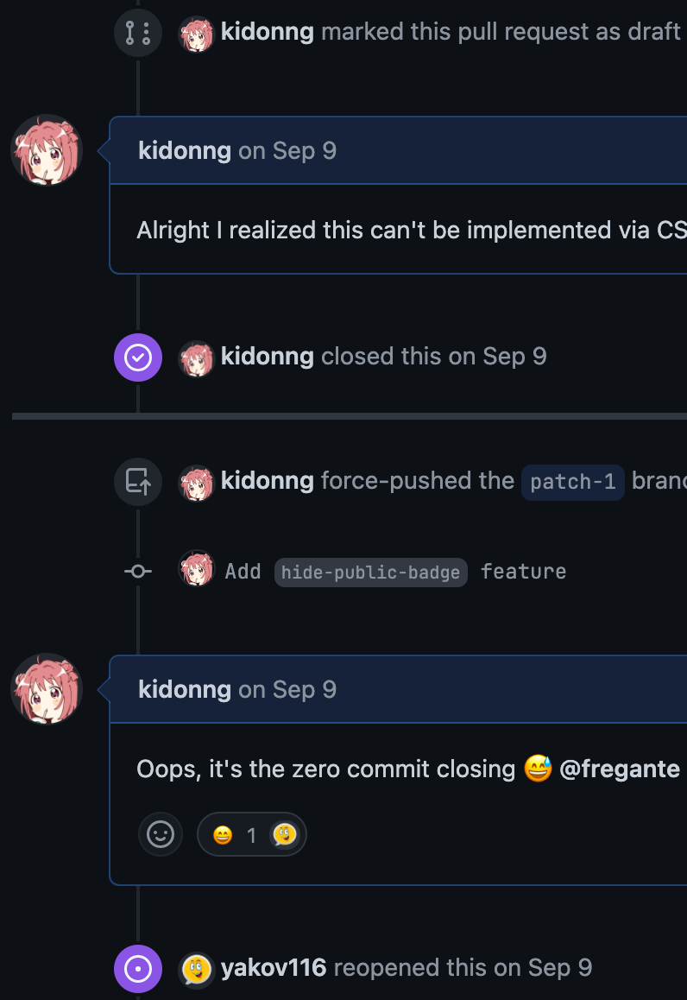
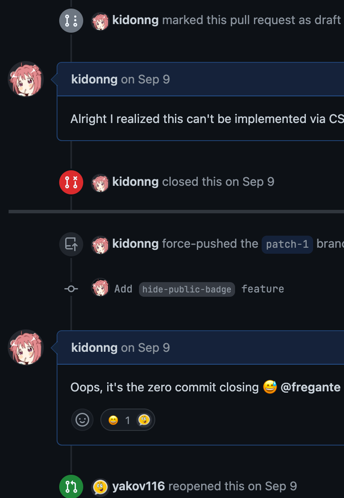
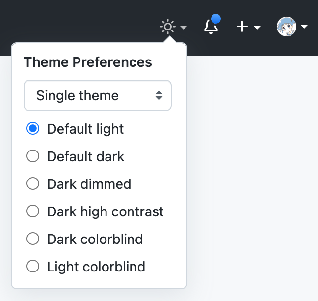

# 用户脚本

[English](README.md) | 简体中文

使用用户脚本需要用户脚本管理器，例如 [Violentmonkey](https://violentmonkey.github.io/get-it/)。

如果你喜欢我的 GitHub 用户脚本，请务必也了解下 [Refined GitHub](https://github.com/refined-github/refined-github)。

---

## [YouTube 截图](youtube-screenshot.user.js?raw=true)


向 YouTube 添加截图按钮（快捷键： <kbd>s</kbd>）。

-   点击以保存。文件名会使用视频标题和时间戳
-   使用右键菜单进行复制等
-   按 <kbd>Esc</kbd> 取消

**注** 由于实现限制，截图的颜色可能与视频不一致。

## [YouTube 迷你播放器](youtube-mini-player.user.js?raw=true)


为 YouTube 增加类似 Bilibili 的悬浮迷你播放器，用于便捷地阅读评论等。

-   拖拽以移动
-   已知问题：
    -   无法调整大小
    -   无法在剧场模式和全屏下使用
    -   部分控件（进度条、音量等） 不跟随光标。这是实现限制导致的。

## [拦截 Notion 统计](https://cherry.xuann.wang/block-notion-analytics.user.js)

拦截下列 Notion 使用的统计服务：

-   Amplitude
-   Intercom（注：客户支持聊天也会不可用）
-   Segment
-   Sentry
-   Statsig

---

**本脚本兼容 Notion 桌面端应用。**

macOS 用法示例：在终端执行以下命令。每次应用升级都需进行此操作。

```sh
curl https://cherry.xuann.wang/block-notion-analytics.user.js >> /Applications/Notion.app/Contents/Resources/app/renderer/preload.js
```

## [Notion 本地化](https://cherry.xuann.wang/notion-localization.user.js)

启用更多语言的 Notion 原生本地化翻译。

注：

-   必须登录方可生效
-   如果 Notion 的代码比脚本先运行后者就可能失效。碰到这种情况请通过 [`https://www.notion.so`](https://www.notion.so) 打开 Notion 或一直刷新。



---

**本脚本兼容 Notion 桌面端应用。**

macOS 用法示例：在终端执行以下命令。每次应用升级都需进行此操作。

```sh
curl https://cherry.xuann.wang/notion-localization.user.js >> /Applications/Notion.app/Contents/Resources/app/renderer/preload.js
```

## [Refined Danbooru](https://cherry.xuann.wang/refined-danbooru.user.js)

让 [Danbooru](https://safebooru.donmai.us/) 再次伟大。

-   [更多键盘快捷键](https://github.com/danbooru/danbooru/issues/5175)。新快捷键可在 Danbooru 的[键盘快捷键页面](https://safebooru.donmai.us/static/keyboard_shortcuts)查看。
-   <kbd>esc</kbd> 清除搜索框
    -   搜索框为空时，<kbd>esc</kbd> 取消聚焦搜索框
-   可展开的标签列表
-   Danbooru 不准搜索 2 个以上标签时使用 Gelbooru
-   <kbd>Alt</kbd> + 点击标签将其添加到搜索框或移除
-   改进 "Related Tags"
    -   恢复 <kbd>Meta</kbd> / <kbd>Shift</kbd> 点击标签的行为
    -   <kbd>Alt</kbd> + 点击选择/取消选择所有同类标签
-   改进 `safebooru.donmai.us`
    -   替换站点名称为易于辨认的 "Safebooru"
    -   受限图片提示中的链接指向当前页面
-   恢复图片预览的拖放

## [NCU Net](ncu-net.user.js?raw=true)

南昌大学校园网助手。支持 `NCU-5G/NCU-2.4G` 和 `NCUWLAN`。

_另见 [NCU Net](https://github.com/kidonng/ncu-net/blob/master/README-zh-CN.md) 命令行程序。_

### 功能

-   无跳转登录
-   记住用户名和密码
-   自动重连
-   连接日志

**注** 可以在脚本中[设置超时和重连时间](ncu-net.user.js#L14-L20)。

## [GitHub fzf 搜索](https://cherry.xuann.wang/github-fzf-finder.user.js)

用 [fzf](https://github.com/ajitid/fzf-for-js) 替换 GitHub 的 "Go to file" 功能 (<kbd>t</kbd>)，并支持[“增强搜索模式”](https://github.com/junegunn/fzf#search-syntax)。



**注意**：暂不支持实时高亮当前匹配项目。

## [GitHub 悬浮卡片](https://cherry.xuann.wang/github-hovercards.user.js)

_实现 [refined-github#5052](https://github.com/refined-github/refined-github/issues/5052)_

为下列类型的 GitHub 链接启用原生信息悬浮卡片：

-   仓库文件树
-   议题与拉取请求
-   讨论
-   提交
-   用户与组织信息

## [GitHub 隐藏 public 标签](https://cherry.xuann.wang/github-hide-public-badge.user.js)

_移植自 [refined-github#4770](https://github.com/refined-github/refined-github/pull/4770)_

隐藏仓库的 "Public" 标签或移除 "Public" 前缀。


## [GitHub 对话列表头像](https://cherry.xuann.wang/github-conversation-list-avatars.user.js)

_实现 [refined-github#4906](https://github.com/refined-github/refined-github/issues/4906#issuecomment-940602726)_

向 GitHub 的议题和拉取请求列表添加头像。


## [~~GitHub 仓库头像~~](https://cherry.xuann.wang/github-repository-avatars.user.js)

> **Warning** 已弃用。请使用 [Refined GitHub](https://github.com/refined-github/refined-github) 的 `repo-avatars` 功能。

_实现 [refined-github#5546](https://github.com/refined-github/refined-github/issues/5546)_

为 GitHub 仓库添加头像，类似于官方移动应用。


## [~~GitHub 图标调整~~](https://cherry.xuann.wang/github-icon-tweaks.user.js)

> **Warning** 已弃用。GitHub 已实施绝大部分改动。

_实现 [refined-github#5007](https://github.com/refined-github/refined-github/issues/5007)_

调整部分 GitHub 图标的颜色和样式。

| 启用前                                                  | 启用后                                                |
| ------------------------------------------------------- | ----------------------------------------------------- |
|  |  |

## [Pages 源链接](https://cherry.xuann.wang/pages-source.user.js)

访问以下 Git 托管平台上的站点时，在右下角显示一个链接到原始仓库的 logo:

-   [GitHub Pages](https://pages.github.com/)
-   [GitLab Pages](https://docs.gitlab.com/ee/user/project/pages/)
-   [Gitee Pages](https://gitee.com/help/articles/4136)
-   [SourceForge Project Web](https://sourceforge.net/p/forge/documentation/Project%20Web%20Services/)

## [Camo 侦探](camo-detective.user.js?raw=true)

_实现 [refined-github#4132](https://github.com/refined-github/refined-github/issues/4132#issuecomment-904022040)_

替换 GitHub 上的 `camo.githubusercontent.com` 图片链接为图片的 `data-canonical-src` 属性。

## [清理 GitHub 消息订阅](clean-github-subscriptions.user.js?raw=true)

自动取消所有已关闭/合并的 issue/PR 的消息订阅。

安装脚本后前往[订阅](https://github.com/notifications/subscriptions)页面即可。

**注意**

-   **脚本无法知道哪些消息订阅需要被保留，操作前请注意。** 如果只想取消某些消息订阅，使用页面上的“Reason“下拉菜单。
-   如果脚本呆呆地每次只取消一个订阅，请手动翻页。
-   如果脚本停止运行，可能是遇到了服务器错误或者请求过于频繁。请稍后重试。

## [GitHub 精确数据](github-precise-counters.user.js?raw=true)

_实现 [refined-github#3382](https://github.com/refined-github/refined-github/issues/3382)_


鼠标悬浮时显示精确的 watch/star/fork 数据。与 [Refined GitHub](https://github.com/refined-github/refined-github) 的 `hide-watch-and-fork-count` 功能兼容。

## [GitHub 个人 README 链接](github-profile-readme-link.user.js?raw=true)

_实现 [refined-github#3426](https://github.com/refined-github/refined-github/issues/3426#issuecomment-671077874)_

使个人 README 的顶部链接指向 README 而非仓库。

## [~~GitHub 主题切换~~](https://cherry.xuann.wang/github-theme-switch.user.js)

> **Warning** 已弃用。 请使用 [GitHub 的命令面板](https://github.com/refined-github/refined-github/issues/3802#issuecomment-966471452)。

_移植自 [refined-github#3804](https://github.com/refined-github/refined-github/pull/3804)。_



向 GitHub 顶栏添加主题设置下拉菜单。

另提供[书签](https://cherry.xuann.wang/github-theme-switch.user.bookmarklet.js)版本。

## [GitHub Star 历史](github-star-history.user.js?raw=true)

_实现 [refined-github#4097](https://github.com/refined-github/refined-github/issues/4097)_

在 Stargazers 页面添加一个按钮以在 https://star-history.t9t.io/ 查看 star 历史。

## [重新放置 Octotree 书签图标](https://cherry.xuann.wang/reposition-octotree-bookmark-icon.user.js)

_实现 [octotree#992](https://github.com/ovity/octotree/issues/992)_

启用前：


启用后


## [Telegram 原始媒体](https://cherry.xuann.wang/telegram-raw-media.user.js)

用常规元素展示 `t.me` 上的媒体。使上下文菜单、拖放功能能够对它们生效。

## [自动修复 sinaimg](auto-fix-sinaimg.user.js?raw=true)

使用 `no-referrer` referrer 政策自动修复 `sinaimg.cn` 图片加载。

[测试页面](https://luyilin.github.io/Aoba/)

## 重定向

-   [Wikiwand](wikiwand.user.js?raw=true)：重定向维基百科到 Wikiwand。可替代 Wikiwand 浏览器扩展
-   [Origin Finder](https://cherry.xuann.wang/origin-finder.user.js)：重定向至资源的原始版本，例如原始尺寸的图像
-   [HTTPS Everywhere](https-everywhere.user.js?raw=true)：重定向至 HTTPS 版本（如果网站支持）
-   [Google Bang](https://cherry.xuann.wang/google-bang.user.js): 为 Google 添加 [!Bang 搜索捷径](https://duckduckgo.com/bang)支持
