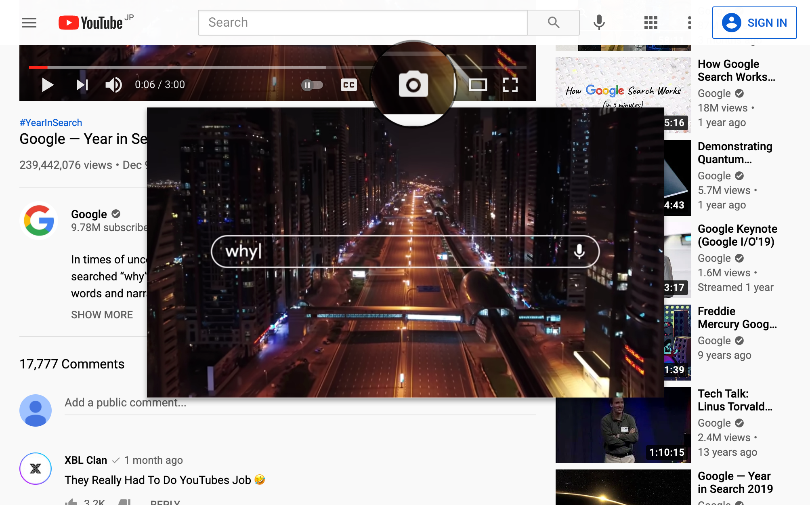
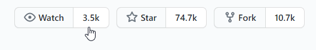

# 用户脚本

[English](README.md) | 简体中文

---

您的浏览器需要安装一个用户脚本管理器（如 Violentmonkey for [Chrome](https://chrome.google.com/webstore/detail/violentmonkey/jinjaccalgkegednnccohejagnlnfdag) 或 [Firefox](https://addons.mozilla.org/firefox/addon/violentmonkey)）。

## [YouTube 截图](youtube-screenshot.user.js?raw=true)

向 YouTube 添加截图按钮（快捷键： <kbd>s</kbd>）。

- 点击以保存。文件名会使用视频标题和时间戳
- 使用右键菜单进行复制等
- 按 <kbd>Esc</kbd> 取消

**注** 由于实现限制，截图的颜色可能与视频不一致。

## [YouTube 迷你播放器](youtube-mini-player.user.js?raw=true)

为 YouTube 增加类似 Bilibili 的悬浮迷你播放器，用于便捷地阅读评论等。

- 拖拽以移动
- 已知问题：
  - 无法调整大小
  - 无法在剧场模式和全屏下使用
  - 部分控件（进度条、音量等） 不跟随光标。这是实现限制导致的。

## [NCU Net](ncu-net.user.js?raw=true)

南昌大学校园网助手。支持 `NCU-5G/NCU-2.4G` 和 `NCUWLAN`。

_另见 [NCU Net](https://github.com/kidonng/ncu-net/blob/master/README-zh-CN.md) 命令行程序。_

### 功能

- 无跳转登录
- 记住用户名和密码
- 自动重连
- 连接日志

**注** 可以在脚本中[设置超时和重连时间](ncu-net.user.js#L14-L20)。

## [Pages 源码](pages-source.user.js?raw=true)

访问 [GitHub Pages](https://pages.github.com/) 站点时，在右下角显示一个链接到原始仓库的 GitHub logo。

## [清理 GitHub 消息订阅](clean-github-subscriptions.user.js?raw=true)

自动取消所有已关闭/合并的 issue/PR 的消息订阅。

安装脚本后前往[订阅](https://github.com/notifications/subscriptions)页面即可。

**注意**

- **脚本无法知道哪些消息订阅需要被保留，操作前请注意。** 如果只想取消某些消息订阅，使用页面上的“Reason“下拉菜单。
- 如果脚本呆呆地每次只取消一个订阅，请手动翻页。
- 如果脚本停止运行，可能是遇到了服务器错误或者请求过于频繁。请稍后重试。

## [GitHub 精确数据](github-precise-counters.user.js?raw=true)

鼠标悬浮时显示精确的 watch/star/fork 数据。与 [Refined GitHub](https://github.com/sindresorhus/refined-github) 的 `hide-watch-and-fork-count` 功能兼容。

## [GitHub 个人 README 链接](github-profile-readme-link.user.js?raw=true)

使个人 README 的顶部链接指向 README 而非仓库。

## [GitHub 主题切换](generated/github-theme-switch.user.js?raw=true)

在 GitHub 的用户下拉菜单中添加主题配置切换。

另提供[书签](generated/github-theme-switch.user-bookmarklet.js?raw=true)版本。

## [GitHub Star 历史](github-star-history.user.js?raw=true)

在 Stargazers 页面添加一个按钮以在 https://star-history.t9t.io/ 查看 star 历史。

## [重新放置 Octotree 书签图标](generated/reposition-octotree-bookmark-icon.user.js?raw=true)

启用前：

启用后

## [自动修复 sinaimg](auto-fix-sinaimg.user.js?raw=true)

使用 `no-referrer` referrer 政策自动修复 `sinaimg.cn` 图片加载。

[测试页面](https://luyilin.github.io/Aoba/)

## 重定向

- [Wikiwand](wikiwand.user.js?raw=true)：重定向维基百科到 Wikiwand。可替代 Wikiwand 浏览器扩展
- [Origin Finder](origin-finder.user.js?raw=true)：重定向至资源的原始版本，例如原始尺寸的图像
- [HTTPS Everywhere](https-everywhere.user.js?raw=true)：重定向至 HTTPS 版本（如果网站支持）
- [Google Bang](google-bang.user.js?raw=true): 为 Google 添加 !Bang 搜索捷径支持
