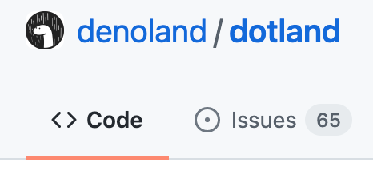

# User Scripts

English | [简体中文](README-zh-CN.md)

A user script manager such as [Violentmonkey](https://violentmonkey.github.io/get-it/) is required to use user scripts.

If you like my GitHub user scripts, be sure to check out [Refined GitHub](https://github.com/refined-github/refined-github).

---

## YouTube

### [YouTube Screenshot](youtube-screenshot.user.js?raw=true)


Add a screenshot button to YouTube (shortcut: <kbd>s</kbd>).

- Click to save. Video title and timestamp will be used as file name
- Use context menu to copy and more
- Press <kbd>Esc</kbd> to cancel

**NOTE** Due to implementation limits, the screenshot's color may not be the same as the video's.

### [YouTube Mini Player](youtube-mini-player.user.js?raw=true)


Floating YouTube mini player like Bilibili, for conveniently reading comments and more.

- Drag to move
- Known issues:
  - Can't resize
  - Doesn't work in Theater mode and Full screen
  - Some controls (progress bar, volume, etc.) doesn't follow cursor. This is due to implementation limits.

## Notion

### [Restore Notion Updates tabs](https://cherry.xuann.wang/restore-notion-updates-tabs.user.js)

Restore “All” and “Following” updates tab in Notion.

[Learn more in this post](https://kidonng.notion.site/Bring-back-All-and-Following-updates-tab-in-Notion-495993c53ecd4a4eacd904a40e9bbb6e).

### [Notion Medium Zoom](https://cherry.xuann.wang/notion-medium-zoom.user.js)

View images in Notion with [Medium-style zoom](https://github.com/francoischalifour/medium-zoom).

[Learn more in this post](https://kidonng.notion.site/Notion-Medium-Zoom-8207e57609ea469f8dfdfe91010f8f46).

### [Block Notion Analytics](https://cherry.xuann.wang/block-notion-analytics.user.js)

Block following analytics services Notion uses:

- Intercom (note: this also disables contact support)
- Segment
- Sentry
- Splunk
- Statsig

### [Notion Localization](https://cherry.xuann.wang/notion-localization.user.js)

Enable Notion's native localization for more languages.

Notes:

- You must be logged in for it to work
- The script may not work if Notion's code happen to run before it. Open [`https://www.notion.so`](https://www.notion.so) or keep refreshing if the issue happens.


### Inject into Notion desktop app

Scripts can be used in Notion desktop app by injecting them into `preload.js`. This need to be done every time the app updates.

For example, to install [Notion Medium Zoom](#notion-medium-zoom) into macOS Notion app:

```sh
curl https://cherry.xuann.wang/notion-medium-zoom.user.js >> /Applications/Notion.app/Contents/Resources/app/renderer/preload.js
```

For Windows Notion app, `preload.js` is located at `%LocalAppData%\Programs\Notion\resources\app\renderer\preload.js`.

## [Refined Danbooru](https://cherry.xuann.wang/refined-danbooru.user.js)

Make [Danbooru](https://safebooru.donmai.us/) great again.

- [More keyboard shortcuts](https://github.com/danbooru/danbooru/issues/5175). New shortcuts can be found on Danbooru's [Keyboard Shortcuts](https://safebooru.donmai.us/static/keyboard_shortcuts) page.
- <kbd>esc</kbd> to clear search boxes
  - <kbd>esc</kbd> to unfocus search boxes when they are clear
- Expandable tag list
- Use Gelbooru to search for more than 2 tags when Danbooru doesn't allow it
- <kbd>Alt</kbd> + click to toggle tag in search box
- Improvements for "Related Tags"
  - Restore <kbd>Meta</kbd> / <kbd>Shift</kbd> click behavior of tag links
  - <kbd>Alt</kbd> + click to (de)select all tags in the same type
- Improvements for `safebooru.donmai.us`
  - Show "Safebooru" as site name to easily recognize it
  - Link hidden post notice to current page/post
- Make post previews draggable

## [NCU Net](ncu-net.user.js?raw=true)

A campus network helper for Nanchang University. Supports `NCU-5G/NCU-2.4G` & `NCUWLAN`.

_Also check out [NCU Net](https://github.com/kidonng/ncu-net) CLI._

### Features

- Jump-free login
- Remember username & password
- Auto reconnect
- Connection logs

**NOTE** You can [configure timeout and retry interval](ncu-net.user.js#L14-L20) in the script.

## GitHub

### [GitHub fzf Finder](https://cherry.xuann.wang/github-fzf-finder.user.js)

Power GitHub's "Go to file" feature (<kbd>t</kbd>) with [fzf](https://github.com/ajitid/fzf-for-js), with support for ["extended-search mode"](https://github.com/junegunn/fzf#search-syntax).


**Note**: Real-time highlighting of currently-matched items is not supported at the moment.

### [GitHub Hovercards](https://cherry.xuann.wang/github-hovercards.user.js)

_Implement [refined-github#5052](https://github.com/refined-github/refined-github/issues/5052)_

Enable native hovercards for most GitHub links of the following types:

- Repository file trees
- Issues & pull requests
- Discussions
- Commits
- Profiles (users & organizations)

### [GitHub hide public badge](https://cherry.xuann.wang/github-hide-public-badge.user.js)

_Ported from [refined-github#4770](https://github.com/refined-github/refined-github/pull/4770)_

Hides "Public" repository badge or removes "Public" prefix.


### [GitHub conversation list avatars](https://cherry.xuann.wang/github-conversation-list-avatars.user.js)

_Implement [refined-github#4906](https://github.com/refined-github/refined-github/issues/4906#issuecomment-940602726)_

Add avatars in GitHub's issue and pull request list.


### [~~GitHub Repository Avatars~~](https://cherry.xuann.wang/github-repository-avatars.user.js)

> **Warning** Deprecated. Use [Refined GitHub](https://github.com/refined-github/refined-github)'s `repo-avatars` feature.

_Implement [refined-github#5546](https://github.com/refined-github/refined-github/issues/5546)_

Add avatars to GitHub repositories, like on official mobile app.



### [~~GitHub icon tweaks~~](https://cherry.xuann.wang/github-icon-tweaks.user.js)

> **Warning** Deprecated. GitHub has implemented most changes.

_Implement [refined-github#5007](https://github.com/refined-github/refined-github/issues/5007)_

Tweak certain GitHub icons' color and style.

| Before                                                  | After                                                 |
| ------------------------------------------------------- | ----------------------------------------------------- |
|  |  |

### [Camo Detective](https://cherry.xuann.wang/camo-detective.user.js)

_Implement [refined-github#4132](https://github.com/refined-github/refined-github/issues/4132#issuecomment-904022040)_

Replace `camo.githubusercontent.com` image links on GitHub with image's `data-canonical-src` attribute.

### [Clean GitHub Subscriptions](clean-github-subscriptions.user.js?raw=true)

Automatically unsubscribe from all closed/merged issues/PR.

Just install the script and head to [Subscriptions](https://github.com/notifications/subscriptions).

**NOTE**

- **There is no way for the script to figure out what thread you want to keep subscribing to, proceed with caution.** Use the "Reason" dropdown if you only want to clean selective subscriptions.
- If the script becomes dumb and only unsubscribe one thread at a time, then manually turn to next page first.
- If the script stops working, you may have an server error or hit a rate limit. Try again later.

### [GitHub Precise Counters](github-precise-counters.user.js?raw=true)

_Implement [refined-github#3382](https://github.com/refined-github/refined-github/issues/3382)_


Show precise watch/star/fork counts on hover. Compatible with [Refined GitHub](https://github.com/refined-github/refined-github)'s `hide-watch-and-fork-count` feature.

### [GitHub profile README link](github-profile-readme-link.user.js?raw=true)

_Implement [refined-github#3426](https://github.com/refined-github/refined-github/issues/3426#issuecomment-671077874)_

Make profile README's header link to the README instead of the repository.

### [~~GitHub theme switch~~](https://cherry.xuann.wang/github-theme-switch.user.js)

> **Warning** Deprecated. Use [GitHub's Command palette](https://github.com/refined-github/refined-github/issues/3802#issuecomment-966471452) instead.

_Ported from [refined-github#3804](https://github.com/refined-github/refined-github/pull/3804)._


Add theme preferences dropdown to GitHub header.

Also available as a [bookmarklet](https://cherry.xuann.wang/github-theme-switch.user.bookmarklet.js).

### [GitHub Star history](github-star-history.user.js?raw=true)

_Implement [refined-github#4097](https://github.com/refined-github/refined-github/issues/4097)_

Adds a button to Stargazers page to view star history on https://star-history.t9t.io/.

### [Reposition Octotree bookmark icon](https://cherry.xuann.wang/reposition-octotree-bookmark-icon.user.js)

_Implement [octotree#992](https://github.com/ovity/octotree/issues/992)_

Before:


After:


## [Pages Source](https://cherry.xuann.wang/pages-source.user.js)

Display a logo in the bottom right corner linked to the source repository when visiting a site hosted on the following Git hosting services:

- [GitHub Pages](https://pages.github.com/)
- [GitLab Pages](https://docs.gitlab.com/ee/user/project/pages/)
- [Gitee Pages](https://gitee.com/help/articles/4136)
- [SourceForge Project Web](https://sourceforge.net/p/forge/documentation/Project%20Web%20Services/)

## [Telegram Raw Media](https://cherry.xuann.wang/telegram-raw-media.user.js)

Show media on `t.me` as regular elements. Make context menu, drag and drop, etc. work on them.

## [Auto fix sinaimg](auto-fix-sinaimg.user.js?raw=true)

Auto fix loading of `sinaimg.cn` images by using `no-referrer` referrer policy.

[Test Page](https://luyilin.github.io/Aoba/)

## Redirects

- [Wikiwand](wikiwand.user.js?raw=true): Redirect Wikipedia to Wikiwand. Can replace Wikiwand browser extension.
- [Origin Finder](https://cherry.xuann.wang/origin-finder.user.js): Redirect to resources' origin version, such as the original size version of images.
- [HTTPS Everywhere](https-everywhere.user.js?raw=true): Redirect to HTTPS version if available
- [Google Bang](https://cherry.xuann.wang/google-bang.user.js): Add support for [!Bang Search Shortcuts](https://duckduckgo.com/bang) to Google
