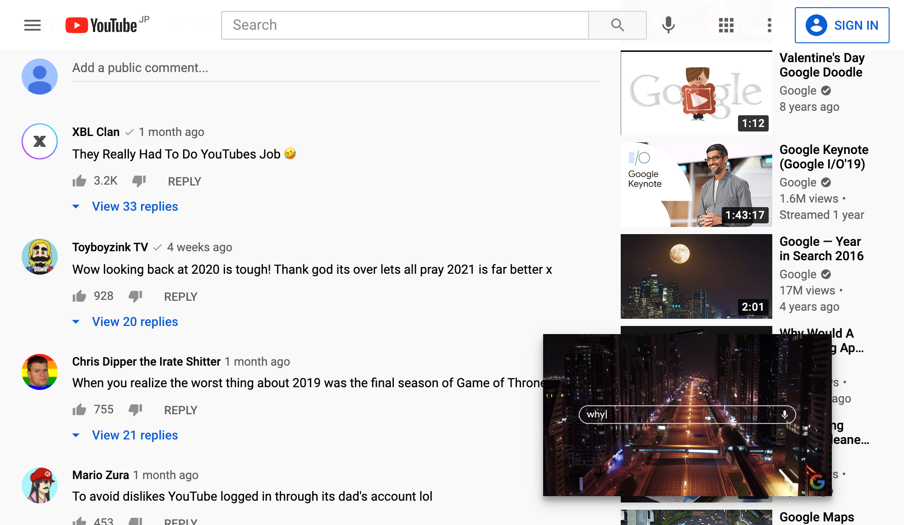

# User Scripts

English | [简体中文](README-zh-CN.md)

---

A user script manager must be installed on your browser.

We recommend Tampermonkey for [Chrome](https://chrome.google.com/webstore/detail/tampermonkey/dhdgffkkebhmkfjojejmpbldmpobfkfo) or [Firefox](https://addons.mozilla.org/firefox/addon/tampermonkey/), as on other user script manager the scripts may not work.

## [YouTube Screenshot](youtube-screenshot.user.js?raw=true)

Add a screenshot button to YouTube (shortcut: <kbd>s</kbd>).

- Click to save. Video title and timestamp will be used as file name
- Use context menu to copy and more
- Press <kbd>s</kbd> to cancel

**NOTE** Due to implementation limits, the screenshot's color may not be the same as the video's.

## [YouTube Mini Player](youtube-mini-player.user.js?raw=true)

Floating YouTube mini player like Bilibili, for conveniently reading comments and more.

- Drag to move
- Known issues:
  - Can't resize
  - Doesn't work in Theater mode and Full screen
  - Some controls (progress bar, volume, etc.) doesn't follow cursor. This is due to implementation limits.

## [NCU Net](ncu-net.user.js?raw=true)

**NCU Campus Network Access Authentication System** Helper. Works on `NCU-5G/NCU-2.4G` & `NCUWLAN`.

_Also check out [NCU Net](https://github.com/kidonng/ncu-net) CLI._

### Features

- Jump- & popup-free login/logout
- Remember username and password
- Auto (re)connect
- Connection logs

### Usage

1. Connect to the network.
2. Open the authentication page ([NCU-5G/NCU-2.4G](http://222.204.3.154/) or [NCUWLAN](http://aaa.ncu.edu.cn/)) and enter your username & password.
3. Click the login/logout button and watch the magic happen!
4. You can [config language & more](./ncu-net.user.js#L12-L31) in the script.

## [Pages Source](pages-source.user.js?raw=true)

Display a GitHub logo in the lower right linked to GitHub Pages' source repository. e.g. [1](https://edwardtufte.github.io/) [2](https://edwardtufte.github.io/tufte-css/)

## [GitHub Precise Counters](github-precise-counters.user.js?raw=true)

Show precise watch/star/fork counts on hover. Compatible with [Refined GitHub](https://github.com/sindresorhus/refined-github)'s `hide-watch-and-fork-count` feature.

## [GitHub profile README link](github-profile-readme-link.user.js?raw=true)

Make profile README's header link to the README instead of the repository.

## [GitHub theme switch](generated/github-theme-switch.user.js?raw=true)

Add theme preferences switch to GitHub's profile dropdown.

Also available as a [bookmarklet](generated/github-theme-switch.user-bookmarklet.js?raw=true).

## [Reposition Octotree bookmark icon](generated/reposition-octotree-bookmark-icon.user.js?raw=true)

Before:

After:

## [Auto fix sinaimg](auto-fix-sinaimg.user.js?raw=true)

Auto fix loading of `sinaimg.cn` images by using `no-referrer` referrer policy.

[Test Page](https://luyilin.github.io/Aoba/)

## Redirects

- [Wikiwand](wikiwand.user.js?raw=true): Redirect Wikipedia to Wikiwand. Can replace Wikiwand browser extension.
- [Origin Finder](origin-finder.user.js?raw=true): Redirect to resources' origin version, such as the original size version of images.
- [HTTPS Everywhere](https-everywhere.user.js?raw=true): Redirect to HTTPS version if available
