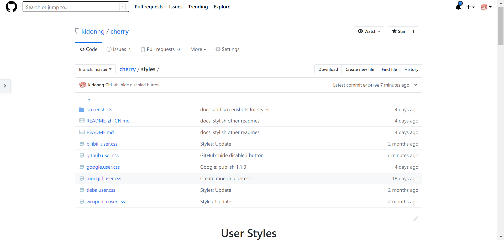
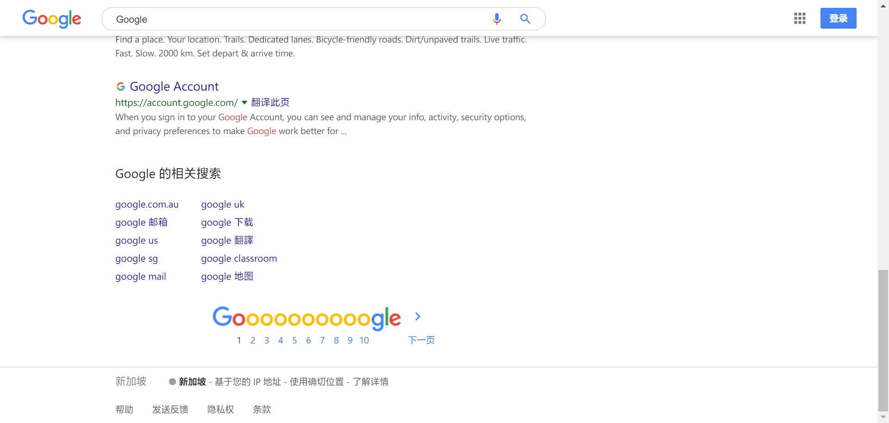
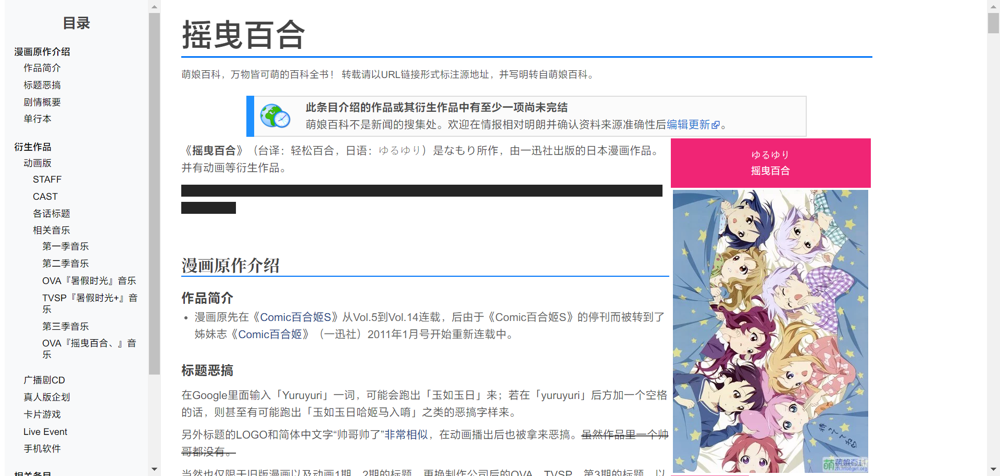

# User Styles

A user style manager (e.g. Stylus for [Chrome](https://chrome.google.com/webstore/detail/stylus/clngdbkpkpeebahjckkjfobafhncgmne) or [Firefox](https://addons.mozilla.org/firefox/addon/styl-us/)) must be installed on your browser.

**NOTE** Some styles include font optimization for Windows (Simplified Chinese) only.

## Original

### [Bilibili](bilibili.user.css?raw=true)

Clean [Bilibili](https://www.bilibili.com/) annoyances.

### [GitHub](github.user.css?raw=true)

Clean flat GitHub style featuring Pixel blue.

### [Google](google.user.css?raw=true)

Opinionated Google Style.

### [Stackblitz](stackblitz.user.css?raw=true)

Clean [Stackblitz](https://stackblitz.com/) annoyances.

### [Tieba](tieba.user.css?raw=true)

Clean [Baidu Tieba](https://tieba.baidu.com/) annoyances.

## Ported

### [Moegirlpedia](moegirl.user.css?raw=true)

[Moegirlpedia](https://zh.moegirl.org/) improved.

#### Source

- [Remastered Moegirl Paper - Sidebar Edition 萌百重设更新](https://userstyles.org/styles/163374/remastered-moegirl-paper-sidebar-edition)
- [Anti-Moe Pedia](https://userstyles.org/styles/145419/anti-moe-pedia)

### [Inoreader](inoreader.user.css?raw=true)

Tweaks for [Inoreader](https://www.inoreader.com/) light theme.

#### Source

[Inoreader Light tweaks](http://userstyles.org/styles/142459)
