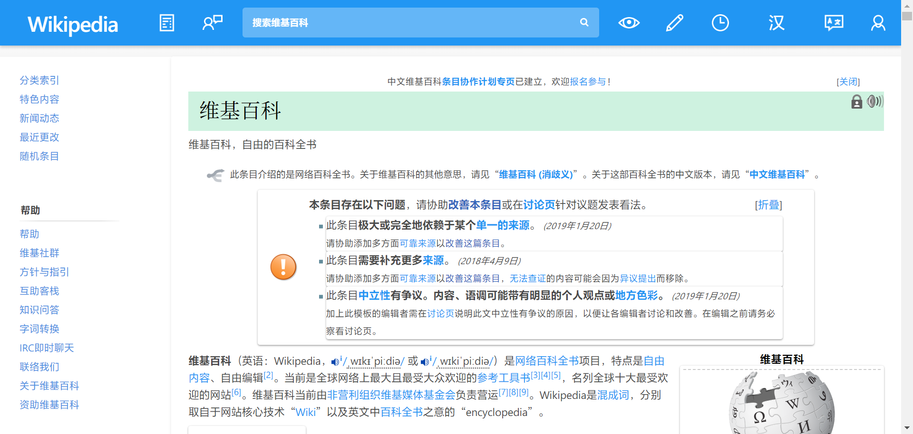

# User Styles

A user style manager such as [Stylus](https://add0n.com/stylus.html) is required to use user styles.

**NOTE** Some styles include font improvements for Windows (Simplified Chinese) only.

## [GitHub](github.user.css?raw=true)

Style improvements for GitHub, best paired with [Refined GitHub](https://github.com/refined-github/refined-github).

Note: "Blue open issues/pull requests and green closed issues/merge pull requests" option requires [GitHub icon tweaks](../scripts/README.md#github-icon-tweaks).

## [Google Tasks](google-tasks.user.css?raw=true)

[Google Tasks](https://tasks.google.com/embed/?origin=https://calendar.google.com&fullWidth=1) on desktop.

## [Typeface](typeface.user.css?raw=true)

Typeface improvements for various sites, best paired with [Font replacement](#font-replacement).

## [Print](print.user.css?raw=true)

Print style improvements for various sites.

## Hide annoyances

- [Bilibili](bilibili.user.css?raw=true)
- [Netlify](netlify.user.css?raw=true)
- [OneDrive Business](onedrive-business.user.css?raw=true)
- [Reddit](reddit.user.css?raw=true)
- [Stackblitz](stackblitz.user.css?raw=true)
- [Tieba](tieba.user.css?raw=true)
- [Twitter](twitter.user.css?raw=true)
- [Vercel](vercel.user.css?raw=true)
- [Zhihu](zhihu.user.css?raw=true)

## Font replacement

- [\[Monospace\] Menlo to JetBrains Mono](menlo-to-jetbrains-mono.user.css?raw=true)
- [\[Monospace\] Menlo to Cascadia Code](menlo-to-cascadia-code.user.css?raw=true)
- [\[Sans-serif\] Arial to SF Pro](arial-to-sf-pro.user.css?raw=true)
- [\[Serif\] Georgia to New York](georgia-to-new-york.user.css?raw=true)

## [Moegirlpedia](moegirl.user.css?raw=true) (Ported)

[Moegirlpedia](https://zh.moegirl.org/) improved.

**Source**:

- [Remastered Moegirl Paper - Sidebar Edition 萌百重设更新](https://userstyles.org/styles/163374/remastered-moegirl-paper-sidebar-edition)
- [Anti-Moe Pedia](https://userstyles.org/styles/145419/anti-moe-pedia)

## [Inoreader](inoreader.user.css?raw=true) (Ported)

Tweaks for [Inoreader](https://www.inoreader.com/) light theme.

**Source**: [Inoreader Light tweaks](http://userstyles.org/styles/142459)

## [Wikipedia](wikipedia.user.css?raw=true) (Ported)

**Source**:

- [Wikipedia Material](https://userstyles.org/styles/140009/wikipedia-material)
- [Wikipedia New Light](https://userstyles.org/styles/139227/wikipedia-new-light)
